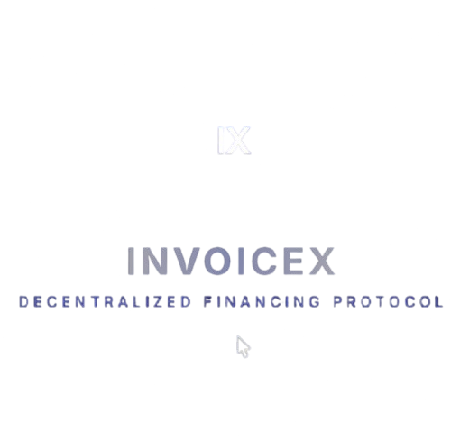
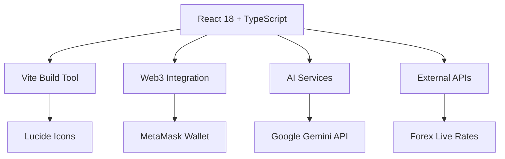

<div align="center">



# 🚀 InvoiceX

### *Borderless Invoice Financing Protocol*

[](https://reactjs.org/)
[](https://www.typescriptlang.org/)
[](https://vitejs.dev/)
[](https://opensource.org/licenses/MIT)

**Transform invoices into NFTs • Access instant liquidity • Enable global investment**

[Live Demo](#-demo-mode) • [Features](#-key-features) • [Getting Started](#-quick-start) • [Architecture](#-architecture)

</div>

---

## 📖 Overview

**InvoiceX** is a revolutionary DeFi protocol built on the QIE blockchain that bridges the gap between SMEs seeking working capital and global investors looking for real-world asset (RWA) opportunities.

### 💡 The Problem We Solve

- **SMEs** wait 30-90 days for invoice payments, creating cash flow bottlenecks
- **Traditional factoring** charges 15-25% with lengthy approval processes
- **Investors** lack access to short-term, asset-backed investment opportunities

### ✨ Our Solution

Transform invoices into tradeable NFTs, enabling:
- ⚡ **Instant liquidity** for businesses
- 🌍 **Borderless capital** access
- 📊 **Transparent** AI-powered risk assessment
- 🔗 **Blockchain-secured** immutable records

---

## 🎯 Key Features

<table>
<tr>
<td width="50%">

### 🏢 For SMEs

- **🎨 NFT Minting**: Tokenize invoices on-chain
- **📤 Smart Upload**: AI extracts invoice data automatically
- **💰 Instant Liquidity**: Get funded within minutes
- **📈 Real-time Dashboard**: Track all invoices
- **🔄 Auto-conversion**: EUR to USDC using live forex

</td>
<td width="50%">

### 💼 For Investors

- **🛒 Live Marketplace**: Browse verified opportunities
- **📊 Portfolio Analytics**: Visual performance tracking
- **⚡ Quick Stake**: Fund invoices with one click
- **💵 Yield Generation**: Earn from repayments
- **📥 Export Reports**: CSV portfolio downloads

</td>
</tr>
</table>

---

## 🖼️ Screenshots & Demo

### 🎭 Interactive Tour
<div align="center">


First-time users are guided through an **interactive onboarding tour** explaining all features.

</div>

### 🎮 Demo Mode

Try the full experience without blockchain setup:

```bash
# Toggle "Demo Mode" in the app header
# Pre-loaded with sample invoices and investments
# Perfect for testing and presentations
```

<div align="center">

| SME Dashboard | Investor Marketplace |
|:-------------:|:--------------------:|
| Track your uploaded invoices | Browse funding opportunities |
| Monitor funding progress | Analyze investment portfolios |
| Manage repayments | Export activity reports |

</div>

---

## 🛠️ Built With

**React, TypeScript, Vite, Node.js, Google Gemini API, MetaMask, Web3, Lucide React, LocalStorage API, Forex API, CSS3, HTML5, Git, npm, QIE Blockchain**

---

## 🏗️ Architecture

### Tech Stack



### Component Structure

```
InvoiceX/
├── 🎨 components/
│   ├── Layout.tsx           # Main app shell with navigation
│   ├── InvoiceCard.tsx      # Reusable invoice display
│   ├── SMEUpload.tsx        # AI-powered invoice upload
│   ├── InvestModal.tsx      # Investment confirmation UI
│   ├── Tour.tsx             # Onboarding experience
│   └── SplashScreen.tsx     # Animated intro
│
├── 🛠️ services/
│   ├── geminiService.ts     # AI invoice extraction
│   └── forexService.ts      # Real-time EUR/USD rates
│
├── 📦 Core Files
│   ├── App.tsx              # Main application logic
│   ├── types.ts             # TypeScript interfaces
│   └── constants.ts         # Mock data & configs
```

---

## 🚀 Quick Start

### Prerequisites

- Node.js 18+ and npm/yarn
- MetaMask or Web3 wallet (for live mode)
- Google Gemini API key (for AI features)

### Installation

```bash
# Clone the repository
git clone https://github.com/ABHIJATSARARI/InvoiceX.git
cd InvoiceX

# Install dependencies
npm install

# Start development server
npm run dev
```

### 🔧 Configuration

Create a `.env` file (if needed):

```env
VITE_GEMINI_API_KEY=your_api_key_here
```

### 🎯 Usage

1. **Launch the app** - Opens on `http://localhost:5173`
2. **Choose your role** - SME or Investor
3. **Connect wallet** (or use Demo Mode)
4. **Start transacting!**

---

## 💼 User Flows

### 🏢 SME Journey

```
📄 Upload Invoice → 🤖 AI Extracts Data → ✅ Review & Confirm 
→ 🎨 Mint NFT → ⏳ Wait for Funding → 💰 Receive Liquidity 
→ 📅 Repay on Due Date
```

### 💼 Investor Journey

```
🔍 Browse Marketplace → 📊 Analyze Opportunity → 💵 Stake Capital 
→ 📈 Track Performance → ✅ Get Repaid + Yield
```

---

## 🧠 AI-Powered Features

### Gemini Integration

- **Automatic Data Extraction**: Upload invoice PDF/image
- **Smart Field Recognition**: Buyer, amount, date, terms
- **Multi-currency Support**: Detects EUR and converts to USDC
- **Validation**: Ensures data accuracy before minting

```typescript
// services/geminiService.ts
export async function extractInvoiceData(file: File) {
  // Converts image to text using Google Gemini Vision
  // Parses structured invoice data
  // Returns typed InvoiceData object
}
```

---

## 📊 State Management

### Data Persistence

- **LocalStorage**: Real user data (invoices, investments, balance)
- **Mock Mode**: In-memory session data for testing
- **Dual State**: Seamlessly toggle between live and demo

```typescript
// Automatic persistence
useEffect(() => {
  localStorage.setItem('invoiceX_invoices', JSON.stringify(realInvoices));
}, [realInvoices]);
```

---

## 🔐 Security & Best Practices

✅ **Client-side Validation**: All inputs sanitized  
✅ **TypeScript**: Type-safe codebase  
✅ **Web3 Security**: Secure wallet connection patterns  
✅ **No Private Keys**: Never store sensitive data  
✅ **Activity Logging**: Complete audit trail  

---

## 🎨 UI/UX Highlights

- 🌙 **Dark Mode Design**: Easy on the eyes
- 📱 **Fully Responsive**: Works on all devices
- ⚡ **Smooth Animations**: Framer Motion-style transitions
- 📊 **Custom Charts**: CSS-only bar & pie visualizations
- 🔔 **Toast Notifications**: Real-time user feedback
- 🎯 **Intuitive Navigation**: Clear role-based views

---

## 🧪 Development

### Available Scripts

```bash
# Development server with HMR
npm run dev

# Production build
npm run build

# Preview production build
npm run preview
```

### Project Dependencies

| Package | Purpose |
|---------|---------|
| `react` `react-dom` | UI framework |
| `@google/genai` | AI invoice processing |
| `lucide-react` | Icon library |
| `typescript` | Type safety |
| `vite` | Build tool & dev server |

---

## 🌟 Future Roadmap

- [ ] 🔗 Multi-chain support (Polygon, Arbitrum)
- [ ] 📱 Mobile app (React Native)
- [ ] 🤝 B2B API for enterprise integration
- [ ] 📈 Advanced analytics dashboard
- [ ] 🏦 Integration with real payment gateways
- [ ] 🌍 Multi-language support
- [ ] 🔔 Email/SMS notifications
- [ ] 📜 Smart contract audits

---

## 🤝 Contributing

We welcome contributions! Here's how:

1. Fork the repository
2. Create a feature branch (`git checkout -b feature/AmazingFeature`)
3. Commit changes (`git commit -m 'Add AmazingFeature'`)
4. Push to branch (`git push origin feature/AmazingFeature`)
5. Open a Pull Request

---

## 📄 License

This project is licensed under the **MIT License** - see the [LICENSE](LICENSE) file for details.

---

## 👨‍💻 Author

**Abhijat Sarari**  
GitHub: [@ABHIJATSARARI](https://github.com/ABHIJATSARARI)

---

<div align="center">

### 🌟 Star this repo if you find it useful!

**Made with ❤️ for the DeFi community**

[](https://github.com/ABHIJATSARARI/InvoiceX/stargazers)
[](https://github.com/ABHIJATSARARI/InvoiceX/network/members)

---

**InvoiceX** • Democratizing Global Trade Finance 🌍

</div>
